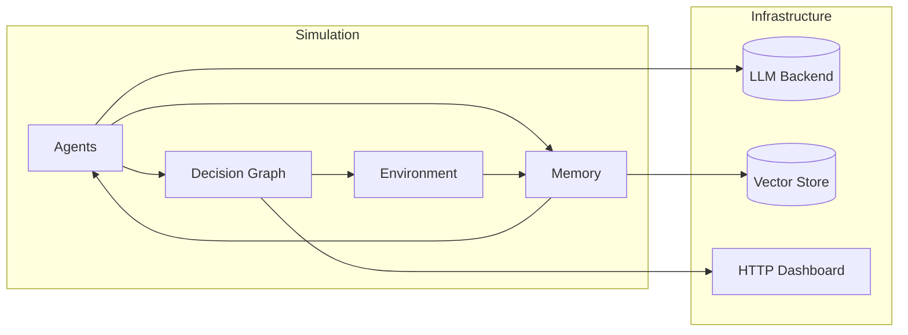
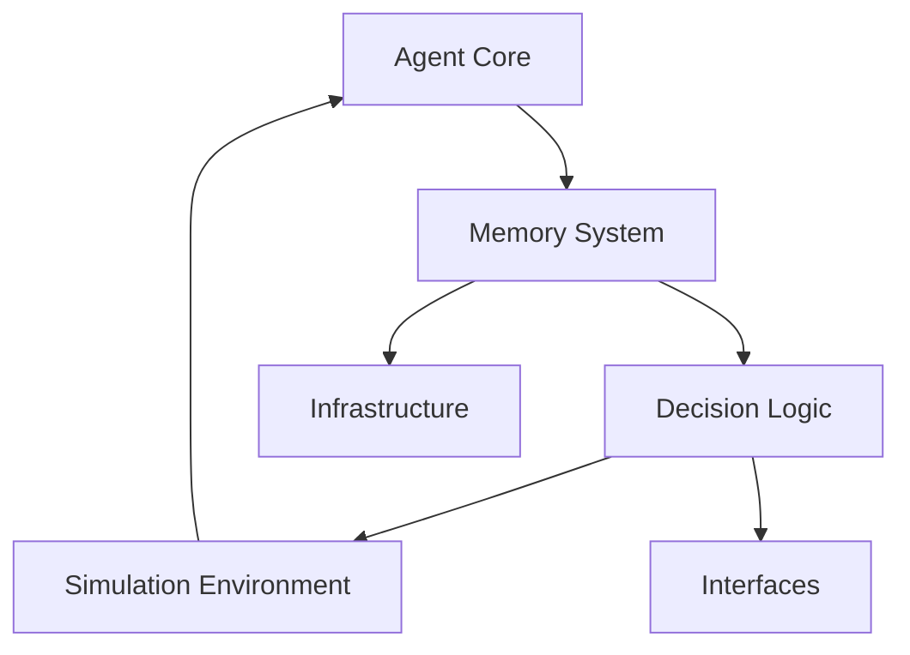
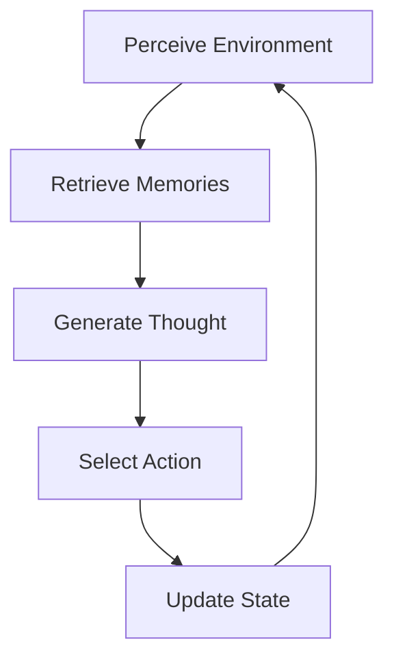

# Culture.ai Architecture Documentation

## 1. Introduction

Culture.ai is an AI Genesis Engine that simulates multi-agent interactions within a social environment. The system enables autonomous agents with distinct roles (Innovator, Analyzer, Facilitator) to communicate, collaborate, and evolve over time. This document provides a comprehensive overview of the system's architecture, explaining key components and their interactions.

## 2. High-Level Architecture

Culture.ai follows a modular design pattern, separating distinct concerns into specialized components that interact through well-defined interfaces.

The diagram below provides a high-level view of how the main pieces fit together.





### Key Architectural Principles

1. **Modularity**: Components are designed with clear boundaries and responsibilities
2. **Extensibility**: The system can be extended with new agent types, roles, and capabilities
3. **Memory-Centric**: Agent capabilities are enhanced by sophisticated memory systems
4. **Configuration-Driven**: Runtime behavior is controlled through centralized configuration

## 3. Agent Core System

### Overview

The Agent Core system (in `src/agents/core/`) provides the foundational classes that define agent state, personality, and behaviors. This module is responsible for maintaining the internal state of each agent throughout the simulation.

### Key Components

#### AgentState

The `AgentState` class (`src/agents/core/agent_state.py`) is a central data structure that:

- Maintains an agent's identity and role information
- Tracks relationships with other agents
- Records mood and sentiment values
- Manages resources (Influence Points, Data Units)
- Tracks project affiliations

Core properties include:

```python
agent_id: str  # Unique identifier
current_role: str  # The agent's current role
mood_state: Dict[str, float]  # Tracks emotional state
relationships: Dict[str, float]  # Stores relationship scores with other agents
influence_points: int  # IP resource count
data_units: int  # DU resource count
```

#### BaseAgent

The `BaseAgent` class (`src/agents/core/base_agent.py`) provides:

- Core initialization of agent properties
- Interface between agent state and decision logic
- Methods for state manipulation and persistence
- Link to agent memory systems

#### Roles

The `Roles` system (`src/agents/core/roles.py`) defines:

- Available agent roles (Innovator, Analyzer, Facilitator)
- Role-specific behaviors and tendencies
- Methods for changing roles and tracking role history

### Interactions

The Agent Core components interact with:
- The Memory system for storing agent experiences
- The Decision Logic system for determining agent actions
- The Simulation Environment for participating in the overall simulation

## 4. Agent Memory System

### Overview

The Agent Memory system (`src/agents/memory/`) provides sophisticated memory capabilities for agents, including hierarchical memory organization, vector-based storage and retrieval, and intelligent pruning mechanisms.

### Key Components

#### ChromaVectorStoreManager

The `ChromaVectorStoreManager` class (`src/agents/memory/vector_store.py`) is the primary interface to the vector database:

- Stores agent memories with metadata and embeddings
- Retrieves memories based on semantic similarity or metadata filters
- Implements memory pruning strategies
- Manages usage statistics tracking for memories

Core methods include:

```python
add_memory()        # Add a new memory to the store
retrieve_relevant_memories()  # Retrieve memories by semantic similarity
retrieve_filtered_memories()  # Retrieve memories by metadata filters
query_memories()    # Combined semantic and metadata filtering
```

#### WeaviateVectorStoreManager

The `WeaviateVectorStoreManager` class (`src/agents/memory/weaviate_vector_store_manager.py`) is an alternative vector store interface using Weaviate:

- Stores agent memories with metadata and *external* (pre-computed) embeddings
- Retrieves memories by vector similarity and metadata filters
- Supports batch add, query, and delete operations
- Can be selected as the backend via configuration

Core methods include:

```python
add_memories()      # Add a batch of memories with vectors and metadata
query_memories()    # Query by vector similarity and optional filters
delete_memories()   # Delete by UUID
delete_collection() # Drop the entire class/collection
```

**Configuration:**
- Set `VECTOR_STORE_BACKEND=weaviate` and `WEAVIATE_URL` in your environment or `.env` file to use Weaviate.
- The agent will use WeaviateVectorStoreManager for all memory operations if configured.

#### Memory Hierarchy

The memory system implements a hierarchical organization:

1. **Raw Memories**: Individual events, thoughts, and interactions
2. **L1 Summaries**: Consolidated summaries of raw memories (step-based windows)
3. **L2 Summaries**: Higher-level summaries of L1 summaries (chapter-based)

#### Memory Utility Score (MUS)

The MUS system (`_calculate_mus()` in `vector_store.py`) intelligently evaluates memories based on:

- Retrieval frequency (how often a memory is accessed)
- Relevance scores (how relevant the memory is when retrieved)
- Recency (when the memory was last accessed)

The MUS formula combines these factors:
```
MUS = (0.4 * RFS) + (0.4 * RS) + (0.2 * RecS)
```

Where:
- RFS = Retrieval Frequency Score = log(1 + retrieval_count)
- RS = Relevance Score = accumulated_relevance / retrieval_count
- RecS = Recency Score = 1.0 / (1.0 + days_since_last_accessed)

### Memory Lifecycle

1. **Creation**: Memories are created during agent turns (thoughts, messages, perceptions)
2. **Storage**: Memories are stored with embeddings and metadata
3. **Retrieval**: Memories are retrieved using RAG techniques during agent decision-making
4. **Consolidation**: Raw memories are periodically consolidated into L1 summaries
5. **Chapter Synthesis**: L1 summaries are synthesized into L2 chapter summaries
6. **Pruning**: Lower-utility memories are removed based on age and MUS values

## Hierarchical Memory

The agent memory system is organized hierarchically into two main levels:

- **L1 Summaries (Session/Step Level):** Capture recent events, thoughts, and actions for each agent over a short window (typically 10 steps). L1s are consolidated frequently and pruned more aggressively.
- **L2 Summaries (Chapter Level):** Synthesize multiple L1 summaries into higher-level, longer-term insights. L2s are consolidated less frequently and pruned more conservatively, as they represent more valuable, synthesized knowledge.

```mermaid
graph TD
    Raw[Raw Memories] -->|Consolidate| L1[L1 Summaries]
    L1 -->|Synthesize| L2[L2 Summaries]
    Raw -->|RAG Retrieval| RAG[(RAG)]
    L1 -->|RAG Retrieval| RAG
    L2 -->|RAG Retrieval| RAG
    Raw -.->|Prune (Age/MUS)| RawPrune[Pruned]
    L1 -.->|Prune (Age/MUS)| L1Prune[Pruned]
    L2 -.->|Prune (Age/MUS)| L2Prune[Pruned]
```

## Memory Utility Score (MUS)

The **Memory Utility Score (MUS)** quantifies the importance of each memory using a weighted formula:

    MUS = (0.4 × Retrieval Frequency Score) + (0.4 × Relevance Score) + (0.2 × Recency Score)

- **Retrieval Frequency Score (RFS):** log(1 + retrieval_count)
- **Relevance Score (RS):** Average relevance of retrievals
- **Recency Score (RecS):** 1 / (1 + days_since_last_accessed)

MUS is updated dynamically as memories are retrieved and used in RAG.

## Memory Pruning/Lifecycle

Pruning is performed using both age-based and MUS-based strategies:

- **L1 Pruning:**
  - Age-based: L1s are pruned after being consolidated into L2s and after a delay.
  - MUS-based: L1s with MUS < 0.2 are pruned (as per the l1_low_l2_medium configuration).
- **L2 Pruning:**
  - Age-based: L2s older than a configured max age (default: 30 days) are pruned.
  - MUS-based: L2s with MUS < 0.3 are pruned.

### Configured Thresholds (as of v1.2)

- **L1 MUS Threshold:** 0.2
- **L2 MUS Threshold:** 0.3
  - **Configuration:** l1_low_l2_medium (see archives/benchmarks/mus_threshold_tuning_report.md [archived])

These values were selected based on the MUS threshold tuning experiments (see report for details), balancing memory efficiency and RAG performance. Asymmetric thresholds (lower for L1, higher for L2) provide optimal tradeoff between aggressive pruning of less critical L1s and preservation of high-value L2s.

## 5. Agent Decision Logic

### Overview

The Agent Decision Logic system (primarily in `src/agents/graphs/basic_agent_graph.py`) implements the turn-based reasoning and decision-making process using LangGraph, a directed graph framework for LLM workflows.

### LangGraph Structure

The agent decision process is modeled as a graph with specialized nodes for different processing steps:



### Key Nodes

#### analyze_perception_sentiment_node

This node:
- Analyzes perceived messages for sentiment
- Calculates an aggregated sentiment score
- Influences the agent's mood and relationships

#### prepare_relationship_prompt_node

This node:
- Retrieves relationship context with other agents
- Formats relationship information for the LLM
- Creates prompt modifiers based on relationship status

#### retrieve_and_summarize_memories_node

This node:
- Retrieves relevant memories using RAG techniques
- Summarizes retrieved memories for context
- Balances recent and important older memories

#### generate_thought_and_message_node

This node:
- Processes all inputs to generate the agent's thought
- Determines whether to send a message and to whom
- Selects an action intent based on context
- Outputs structured response using `AgentActionOutput`

#### Action Intent Handlers

Specialized nodes process different action intents:
- `handle_continue_collaboration_node`: Standard interaction mode
- `handle_propose_idea_node`: Proposing new ideas (costs IP)
- `handle_create_project_node`: Creating new projects (costs IP and DU)
- `handle_join_project_node`: Joining existing projects
- `handle_ask_clarification_node`: Requesting more information
- Other specialized intent handlers

#### update_state_node

This node:
- Updates the agent's state based on decisions
- Triggers memory consolidation when needed
- Manages relationships and resources
- Handles role change requests

#### Memory Management Nodes

Several nodes manage the memory lifecycle:
- `_maybe_consolidate_memories`: Triggers L1/L2 summary generation
- `_maybe_prune_l1_memories`: Age-based L1 memory pruning
- `_maybe_prune_l2_memories`: Age-based L2 memory pruning
- `_maybe_prune_l1_memories_mus`: MUS-based L1 memory pruning
- `_maybe_prune_l2_memories_mus`: MUS-based L2 memory pruning

### Graph Routing Logic

The LangGraph structure defines routing logic that:
- Creates a linear flow for the core processing steps
- Branches based on action intent for specialized processing
- Returns to common paths for state updates and finalizations

### Initialization

The `create_basic_agent_graph()` function assembles all nodes into a structured graph with:
- Defined entry and exit points
- Conditional routing logic
- Error handling paths

## 6. DSPy Programs

### Overview

The DSPy Programs system (`src/agents/dspy_programs/`) implements optimized prompting strategies using the DSPy framework, which provides a programmatic interface for prompt engineering and few-shot learning.

### Key Components

#### L1SummaryGenerator

The `L1SummaryGenerator` class generates consolidated summaries of raw memories:
- Takes recent events and agent state as input
- Produces structured summaries that capture key information
- Uses role-specific optimization for better summaries

#### L2SummaryGenerator

The `L2SummaryGenerator` class creates higher-level "chapter" summaries:
- Synthesizes multiple L1 summaries into cohesive narratives
- Captures long-term patterns and developments
- Preserves role-specific thinking patterns

#### RoleSpecificSummaryGenerator

The `RoleSpecificSummaryGenerator` class enhances summary generation by:
- Loading role-optimized models for each agent role
- Selecting appropriate summarizer based on agent role
- Providing fallback options when role-specific models are unavailable

### Optimization Process

DSPy programs are optimized through:
- Defining signature classes that specify input/output structure
- Creating example sets for each agent role
- Using `BootstrapFewShot` to find optimal few-shot examples
- Saving compiled models for runtime use

### Integration with Memory System

DSPy programs integrate with the memory system by:
- Generating L1 summaries during memory consolidation
- Creating L2 summaries at chapter boundaries
- Providing role-appropriate context for memory retrieval

### DSPy Programs Compliance Note (2025-05-18)
All DSPy program modules in `src/agents/dspy_programs/` are strictly compliant with Mypy (strict mode) and Ruff, with only justified ignores for `dspy.Signature` dynamic base classes. Robust fallback logic and async DSPy management are implemented throughout.

## 6.1 Asynchronous DSPy Program Management (AsyncDSPyManager)

### Overview

The `AsyncDSPyManager` (`src/shared/async_utils.py`) is a core infrastructure component that manages all DSPy program calls asynchronously using a thread pool. It provides:
- **Non-blocking execution** of DSPy programs, improving simulation responsiveness and throughput.
- **Timeout handling**: If a DSPy call exceeds the allowed time, the manager returns a failsafe output.
- **Graceful error recovery**: Exceptions in DSPy calls are caught, logged, and replaced with safe fallback results.

### Integration Points

- **BaseAgent Methods**: All agent methods that invoke DSPy programs (e.g., action selection, memory summarization, relationship updating) now use `AsyncDSPyManager` and are defined as `async def`. These methods must be awaited.
- **LangGraph Nodes**: Any graph node that calls these agent methods must also be `async def` and use `await`.
- **Simulation Loop**: The main simulation loop in `src/app.py` is now asynchronous and uses `asyncio.run()` to drive agent turns.
- **DSPy Program Requirements**: All DSPy program modules must provide a `get_failsafe_output()` method, which returns a safe default output for use in error/timeout cases.

### Developer Implications

- **Concurrency Model**: AsyncDSPyManager uses a `ThreadPoolExecutor` internally, allowing multiple DSPy calls to run in parallel without blocking the event loop.
- **Async/Await Discipline**: Any code path that triggers DSPy program execution must be async and use `await` for correct scheduling and error handling.
- **Timeouts and Failsafes**: Developers can configure per-call or default timeouts. On timeout or error, the manager logs the issue and returns the program's failsafe output, ensuring simulation stability.
- **Error Logging**: All timeouts and exceptions are logged with context, aiding in debugging and monitoring.

### Benefits

- **Responsiveness**: Agents and the simulation remain responsive even if some DSPy calls are slow or fail.
- **Robustness**: The system degrades gracefully under LLM/DSPy errors, always producing a valid output.
- **Scalability**: Parallel DSPy execution enables scaling to larger agent populations and more complex simulations.

For implementation details, see the docstrings in `AsyncDSPyManager`, the async methods in `BaseAgent`, and the async graph nodes in `basic_agent_graph.py`.

## 7. Infrastructure

### Overview

The Infrastructure system (`src/infra/`) provides core services and utilities used throughout the application, including configuration management, LLM integration, and DSPy support.

### Key Components

#### Configuration Management

The `config.py` module (described in detail in `docs/configuration_system.md`):
- Loads settings from environment variables and .env files
- Provides default values for all configuration options
- Offers helper functions for accessing configuration values
- Organizes settings into logical categories

#### LLM Client

The `llm_client.py` module provides:
- A unified interface for LLM interactions
- Functions for different types of LLM tasks (generation, structured output, sentiment analysis)
- Error handling and retry logic
- Formatting utilities for different prompt types

#### DSPy Ollama Integration

The `dspy_ollama_integration.py` module:
- Configures DSPy to work with Ollama
- Implements custom LM classes for Ollama compatibility
- Provides optimization utilities for DSPy programs
- Manages caching for improved performance

### Usage Patterns

Infrastructure components are used throughout the system:
- Configuration is accessed by all modules that need customizable behavior
- LLM client is used by agent decision logic and DSPy programs
- DSPy integration is used by memory summarization components

### Infrastructure Compliance Note (2025-05-18)
All infrastructure code in `src/infra/` is strictly compliant with Mypy (strict mode) and Ruff, with only justified ignores for `ollama.Client` return types due to third-party stub limitations. DSPy integration is robust and fully async-capable.

## 8. Simulation Environment

### Overview

The Simulation Environment (`src/sim/`) manages the overall simulation, including agent interactions, turn sequencing, and shared resources.

### Key Components

#### Simulation

The `Simulation` class (`src/sim/simulation.py`):
- Initializes and maintains the population of agents
- Manages the turn-based simulation loop
- Handles message routing between agents
- Tracks simulation metadata and progress
- Provides hooks for observation and analysis

#### Knowledge Board

The `KnowledgeBoard` class (`src/sim/knowledge_board.py`):
- Provides a shared space for information exchange
- Manages entry lifecycle (creation, access, archiving)
- Implements relevance scoring for entries
- Offers filtering and retrieval mechanisms

#### Project System

The project-related components:
- Track project metadata and membership
- Manage resource costs for project operations
- Enforce project constraints (member limits)
- Facilitate collaboration mechanics

### Simulation Lifecycle

1. **Initialization**: Create agents and environment
2. **Step Execution**: Process agent turns in sequence
3. **Message Routing**: Deliver messages between agents
4. **Resource Updates**: Adjust IP/DU based on actions
5. **Environment Updates**: Update shared resources like the knowledge board
6. **Observation**: Record metrics and state for analysis

## 9. Interfaces

### Overview

The Interfaces system provides ways to interact with the simulation, both for input/output and for visualization/analysis.

### Key Components

#### Discord Bot

The `DiscordBot` class (`src/interfaces/discord_bot.py`):
- Connects the simulation to Discord channels
- Streams agent interactions to human observers
- Allows for potential human intervention
- Provides visualization of simulation state

#### Visualization Tools

Various tools in the `tools/` directory:
- `visualize_agent_memory.py`: Visualizes agent memory structures
- `query_agent_memory.py`: Allows direct queries to agent memories

#### Benchmarking

Benchmarking tools were archived with the former `benchmarks/` directory.
These scripts evaluated memory system performance, MUS scoring, different
pruning strategies, and overall RAG retrieval effectiveness.

## 10. Configuration Management

Culture.ai uses a centralized configuration system documented in `docs/configuration_system.md`. Key aspects include:

- Environment variables and .env files for settings
- Sensible defaults defined in `src/infra/config.py`
- Logical organization of settings by functional area
- Helper functions for safe access to configuration

## 11. Memory System Deep Dive

### Hierarchical Memory Architecture

Culture.ai implements a three-tier memory hierarchy:

1. **Raw Memories**: Individual events, thoughts, and perceptions
   - High detail, low abstraction
   - Tagged with metadata (step, event_type, etc.)
   - Most numerous and most subject to pruning

2. **L1 Summaries (Consolidated)**: Window-based summaries
   - Consolidate raw memories from specific time windows
   - Preserve key information while reducing volume
   - Generate with role-specific DSPy programs
   - Intermediate persistence (pruned after L2 creation)

3. **L2 Summaries (Chapters)**: Long-term narrative summaries
   - Synthesize multiple L1 summaries into coherent narratives
   - Capture patterns, developments, and important events
   - Retain role-specific perspective and insights
   - Highest persistence (rarely pruned)

### RAG Implementation

The Retrieval-Augmented Generation (RAG) system:

1. Embeds all memories using sentence transformers
2. Stores embeddings in ChromaDB with metadata
3. Processes queries through the same embedding model
4. Retrieves memories based on embedding similarity
5. Optionally filters by metadata (event type, time, etc.)
6. Summarizes retrieved contexts for agent decision-making

### Pruning Strategies

Culture.ai uses multiple pruning strategies:

1. **Age-Based Pruning**: Remove memories older than configured thresholds
2. **MUS-Based Pruning**: Evaluate utility based on usage patterns
3. **Type-Based Pruning**: Apply different strategies to different memory types
4. **Consolidation**: Replace raw memories with summaries

### Memory Usage Tracking

The system tracks memory usage metrics:
- `retrieval_count`: How often a memory is accessed
- `last_retrieved_timestamp`: When a memory was last accessed
- `accumulated_relevance_score`: How relevant the memory has been when retrieved
- `retrieval_relevance_count`: How many times relevance was measured

These metrics feed into the MUS calculation for intelligent pruning decisions.

## 12. DSPy Integration Strategy

Culture.ai uses DSPy to implement optimized prompting strategies:

### Core Approach

1. **Signature Definitions**: Define input/output structures for LLM tasks
2. **Example Creation**: Develop high-quality examples for each task
3. **Optimization**: Use techniques like `BootstrapFewShot` to find optimal examples
4. **Compilation**: Save optimized programs for runtime use
5. **Role Specialization**: Create role-specific variants for better results

### Integration Points

DSPy is primarily used for:
- Memory summarization (L1 and L2)
- Role-specific thought patterns
- Specialized tasks requiring few-shot learning

### Optimization Workflow

The process for creating optimized DSPy programs:
1. Define the task signature (input/output schema)
2. Create example datasets specific to each role
3. Run optimization scripts (`experiments/optimize_role_*_summarizers.py`)
4. Save compiled models to `src/agents/dspy_programs/compiled/`
5. Load at runtime via the `RoleSpecificSummaryGenerator`

## 13. Testing Strategy

Culture.ai employs several testing approaches:

### Unit Tests

Located in `tests/unit/`, these focus on:
- Individual component functionality
- Isolated behavior verification
- Fast execution and high coverage

### Integration Tests

Located in `tests/integration/`, these verify:
- Component interactions
- End-to-end workflows
- Memory system functionality
- Agent decision-making processes

### Benchmarks

The original benchmarking suite has been archived. These tools evaluated:
- Performance characteristics
- Resource utilization
- Effectiveness of algorithms (e.g., MUS pruning)
- RAG relevance and quality

### Test Data

The system includes:
- Example memories and contexts
- Synthetic agent interactions
- Predefined scenarios for consistent testing

## 14. Future Development Areas

Potential areas for future architectural enhancement:

1. **Enhanced Agent Models**: More sophisticated agent reasoning capabilities
2. **Expanded Role System**: Additional specialized roles beyond the current three
3. **Improved RAG**: More advanced retrieval techniques for memory access
4. **Multi-Modal Support**: Handling images, audio, or other data types
5. **Distributed Simulation**: Scaling to larger agent populations
6. **Human-in-the-Loop**: More robust interfaces for human participation
7. **Learning Mechanisms**: Allowing agents to improve over time
8. **External Knowledge Integration**: Connecting to external information sources

## 15. Conclusion

The Culture.ai architecture provides a flexible, modular foundation for multi-agent simulations. The separation of concerns between agent core, memory, decision logic, and simulation environment allows for independent evolution of these components while maintaining clear interfaces between them.

The memory-centric approach, with its sophisticated hierarchical organization and intelligent pruning, enables agents to develop persistent personalities and knowledge bases that evolve throughout the simulation. The LangGraph-based decision process provides a structured yet flexible framework for agent reasoning and action selection.

This architecture documentation will evolve as the system grows and new capabilities are added. 
